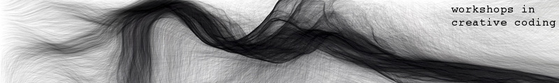

### Workshops in Creative Coding I & II
__instructor__: Theodoros Papatheodorou

__contact__: t.papatheodorou@gold.ac.uk

__office hours__: Mondays 3:00-5:00pm, Room 6, 29 St. James. Please [book](https://theopapa.youcanbook.me/) an appointment.

__mailing list__:
* comparts@doc.gold.ac.uk: for MA/MFA related issues, events on/off campus, etc.
* [gitlab issues](http://gitlab.doc.gold.ac.uk/comp_arts_2015/workshops_in_creative_coding/issues): for all code or technical questions related to the course Workshops in Create Coding.
 
 

This page holds course materials for the level 4 Masters course, Workshops in Creative Coding for the MA/MFA Computational Arts.

The course will introduce you to a range of techniques and practices for creating interactive audiovisual software. This will include computational and process-based thinking, perspectives on audio and visual perception, algorithms for creating graphics and sound, advanced topics in computational media and project development.

Important documents:
* [Course Description](miscellanea/course description.md)
* [Class Syllabus](miscellanea/syllabus.md)
* [Assessment information](miscellanea/assessment.md)
