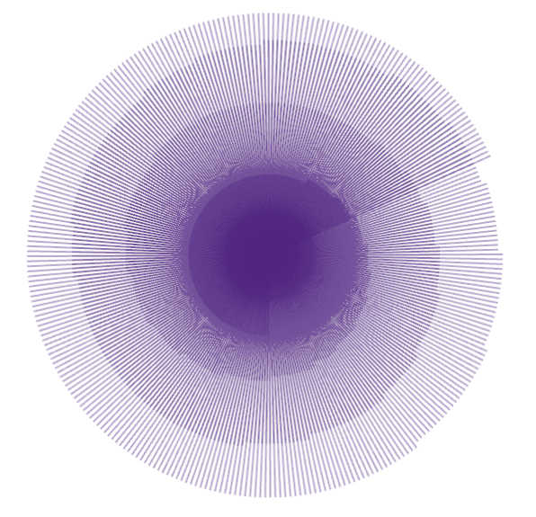
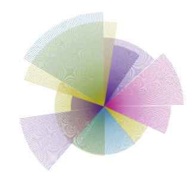
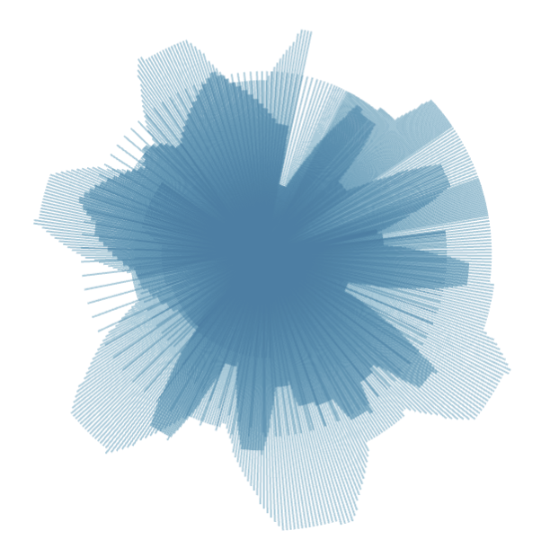
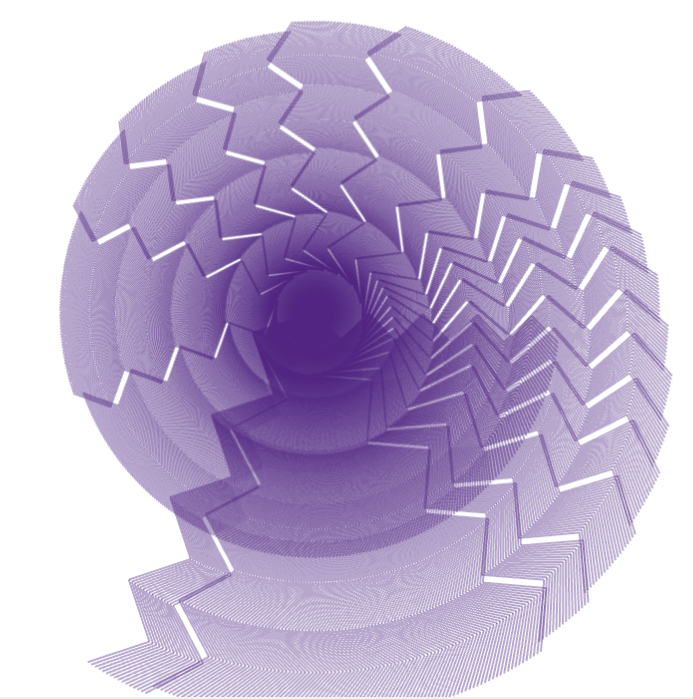

# Animated Brushes

In this assignment you'll have to replicate what is seen on the images inside the _sampleImages_ folder.

## General instructions
1. Start by drawing a rotating line around where the mouse. To do that you'll need to create a global variable of type `bool` (let's call it `drawIsOn`) that whenever mouse is pressed it becomes `true` and whenever mouse is released it becoems `false`. 
2. Inside the `draw()`, when `drawIsOn` is `true` you translate to where the mouse is and rotate by a global variable of type `float` called `angle`.
3. Inside the `update()` function, when `drawIsOn` you increase `angle` by `angleSpeed` (ie you add the global variable `angleSpeed` to it - initial value set to 0.5).

Some bits above are missing, but you should by now be able to fill in the gaps. I gave you the general logic. In my program I added the following bits as well:
* I also scaled my shape by `shapeLength`
* When the down key is pressed I increased the `shapeLength` by a certain amount. This allows for the spirals to happen. I did the opposite when the down key is pressed. If you want to check for up/down key you'll need to check if `key` is equal to `OF_KEY_DOWN` and `OF_KEY_UP` respectively.
* I increased/decreased the `angleSpeed` using the left/right arrow.
* I saved a frame when the 's' was pressed.
* I cleared the canvas when the 'r' was pressed.
* If the a space was pressed I chose a random color (alpha = 100).
* If the 1,2,3,4 button was pressed a pre-set color was selected (alpha = 100).
* Every time the mouse is pressed I give `shapeLength` a different random value between 0.5 and 2.

__Further development:__ How about experimenting with the type of line that is drawn? Instead of a drawing a line

