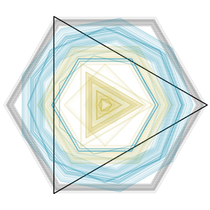

# Generative Shapes
In this exercise we'll create generative shapes like the ones in the _resizedImages_ folder using the location and movement of the mouse on the screen. All of these shapes are in fact circles of varying resolution (ie even the triangle is a circle of resulution 3).


## Directions:
1. In the _main.cpp_ set the window to 600x600.
2. In the _ofApp.h_ you'll need to create two global variables of type `int` called `circleRes` and `circleRad`. These will store the resolution and size of the circle respectively.
3. In the `setup()` make sure the background is not updated, is set to white. Turn off the fill of the shapes, set the initial color to black with the alpha channel equal to 10 and the line width equal to 2.
4. Inside the `update()` use the `ofMap()` function to calculate the resolution of the circle and store it inside `circleRes`. You'll need to use `mouseX` to convert from window coordinates to a value between 3 and 10. Make sure the clamp flag is set to true so that it doesn't wrap values around. Set the circle's radius to half of the coordinate of `mouseY`.
5. Edit the `mouseDragged()` function so that circles are only drawn when the mouse is dragged. Your program should now draw black shapes of varying sizes as you move on the Y-axis and of various resolution as you move on the X-axis.
6. Finally, edit the `keyPressed()` function so that when you press the _r_ button the screen is cleared, when you press _s_ the screen is saved in your hard drive and give a name based on the frame number. Use this command which converts the frame number to a string to the end of which it attaches the ".png" extension and passes that to the `ofSaveScreen()` function which saves the current frame using the string created. For how to do this see [here](http://openframeworks.cc/documentation/application/ofBaseApp.html#!show_keyPressed)
```
ofSaveScreen(ofToString(ofGetFrameNum())+".png");
```
When you press _1_ set the color to black with alpha equal to 10, when you press _2_ set it to a different color with alpha 10 when you press _3_ a third color with alpha 10.
