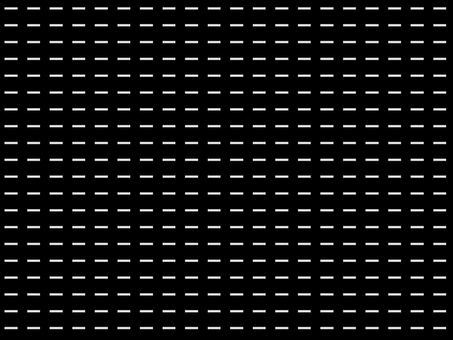
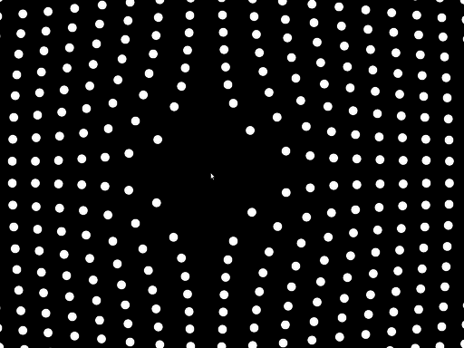

# Magnetic Grid
For a demo of what we want you to deliver, have a look at the __magneticGridDEMO.mkv__ video.

## step by step:
This exercise is somewhat similar to the _nestedForLoop_ example we saw in class. Instead of drawing through an array of squares we are now drawing very thin rectangles. So keeping the _nestedForLoop_ code in mind and start a new project. We'll need the following modifications:

1. Inside the _ofApp.h_ file define the global variables of type `int` with the names `numOfXTiles`, `numOfYTiles`. Also define `spacingX`, `spacingY` which will store the spacing between our shapes and `startingX`, `startingY` which will store the starting position of the first shapes. We don't want the first shape to be at `(0,0)`, that's the origin. Where do we want it?
2. In the `setup()` function set the background to black, initialize the `numOfXTiles` & `numOfYTiles` to 20, calculate the `spacingX` & `spacingY` as well as the `startingX` and `startingY` as we did in the _nestedForLoop_. Also set the rectangle mode to center as shown on the instructions [here](http://openframeworks.cc/documentation/graphics/ofGraphics.html#!show_ofSetRectMode).
3. Inside the `draw()` function write a nested for loop (using the `numberOfXTiles` and `numberOfYTiles` variables in the conditional). Within the loop create the local variables `locX` and `locY` of type `int` that will store in each iteration the location of each shape.
4. Contrary to the _nestedForLoop_ example, we won't use the `locX` variable inside the `ofRect()` command. We'll translate to `(locX, locY)` and draw the rect on the origin of width 30 and height 5. Make sure you do a `pushMatrix()` before translating and a `popMatrix()` after you are done drawing your shapes (before exiting the inner loop). What you should see by now is what is shown in _image1.png_ below.
<br>
<br>

<br>
<br>
5. Now for the meaty part: Calculate the angle as shown in the code snippet below using the `atan2()` [see doc](http://www.cplusplus.com/reference/cmath/atan2/) function.
```
  float angle = atan2(mouseY-locY, mouseX-locX);
```
<br>

<br>
<br>
__Attention:__ the function returns the result in radians. Make sure whatever the function returns you convert it to degrees by using the [ofRadToDeg()](http://openframeworks.cc/documentation/math/ofMath.html#!show_ofRadToDeg) before using it to rotate. What you should see by now is what is shown in _image1.png_ below. The rectangles should turn to face the mouse. You're in a good place. See a similar grid being used in a [live performance](https://youtu.be/qaT64TYsVgA?t=209) by Gideon Obarzanek.
<br>
<br>

<br>
<br>
6. After the `ofRotate()` call, make an `ofTranslate()` call and translate the shape by 100px on the x-axis. Replace the rectangle that you draw with a circle of radius 10. This should now create the impression of a sticky cloth where the circles gather around the position of the mouse. Make sure you set the circle resolution in the setup function to 50.
7. Add `180` degrees in the rotate function call (already in your code). This should now make the circles "avoid" your mouse as in _image3.png_ below.
<br>
<br>

<br>
<br>
8. Calculate the distance between each shape and the mouse using the `ofDist()` ([see doc](http://openframeworks.cc/documentation/math/ofMath.html#show_ofDist)) function and use the value returned inside an `ofMap()` function to convert from the `(0,ofGetWidth()/2)` domain to the `(2,0.5)` one. Make sure the clamp flag is set to true so that these values are not exceeded. Apply the scale factor to each of the shapes using the `ofScale()` function. The circles should not be larger the farther you go from each circle.
9. Final touch: Calculate the distance between each shape and the mouse using the `ofDist()` function and use the value returned inside an `ofMap()` function to convert from the `(0,ofGetWidth()/2)` domain to the `(0,1)` domain. Make sure the clamp flag is set to true so that these values are not exceeded. Save that value in a variable called `colorFactor`. Create two two variables of type `ofColor()` ([see doc](http://openframeworks.cc/documentation/types/ofColor.html)) and use the `getLerped()` ([see doc](http://openframeworks.cc/documentation/types/ofColor.html#show_getLerped)) function to interpolate between the two using the `colorFactor` variable you created.
10. How about changing the `OF_WINDOW` to `OF_FULLSCREEN` in the _main.cpp_ file so that the application takes the whole screen when it starts?
<br>
<br>

__Experimentation (at home):__
* play with the values inside the transformations to see how you can manipulate the results. Play with different shapes too and see what they look like.
* how about getting rid of the latest translation and reverting back to using a rectangle. Create a vector of size `numOfXTiles`x`numOfYTiles` which in `setup()` stores either 45 or -45 in each of the position in the vector. You can use the `ofRectRounded()` command to create rounded rectangles ([see doc](http://openframeworks.cc/documentation/graphics/ofGraphics.html#!show_ofRectRounded)). See what patterns emerge. Perhaps every time you click the mouse the vector gets new random values (of either 45 or -45).

