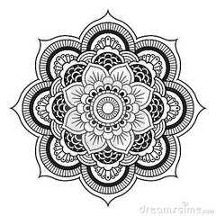
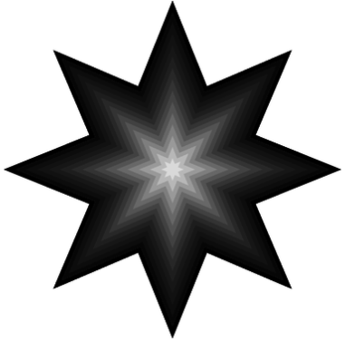

# Mandala shapes
<br>
<br>

<br>
<br>
1. Create a new project and copy the code found in the _starCode.cpp_ file in the _ofApp.cpp_. Make sure you also declare the function inside the _ofApp.h_ (as it's done with all the other functions). This function generates a star by generating points in radial coordinates and joining them together with the `ofBeginShape()` command.
2. Set the background to white and inside the `draw()` function call this:
```
ofSetColor(0);
ofTranslate(ofGetWidth()/2,ofGetHeight()/2)
star(0, 0, 100, 150, 10);
```
which should generate 1 black start in the middle of the screen. 100 is the distance (technically radius) of the inside points from the center while 150 is the distance of the outside points from the center. 10 is the number of edges of the star (ie the resolution). Play with these values so that you become familiar with what they do.
3. Create a local variable called `resolution` inside `draw()` that stores the resolution of the start. Use the `ofMap()` to maps the value of `mouseX` from the `(0,ofGetWidth())` domain to the `(3,20)` domain. Make sure the clamp flag is set to true ([see documentation](http://openframeworks.cc/documentation/math/ofMath.html#show_ofMap)). Replace the 10 in the `star()` call you are making with the `resulution` variable. As you move your mouse from left to right the star's resolution changes. Create a local variable `radius1`, initialized to 200 and replace the 100 in the `star()` call with that. Create a local variable `radius2` and replace the 150 in the `star()` call with that. Calculate the `radius2` value using the `mouseY` mapped from `(0,ofGetHeight())` to `(50,400)` (clamp set to true). Movement on the Y-axis should affect the distance of every second point from the center of the star (how pointy the star is).
4. Create a local variable `noOfStars` initialized to 20. Create a _for_ loop to create stars equal to `noOfStars`. __Attention:__ Make the index type `float` rather than `int`. That's because when we use it later in a division, unless it is a float it is not going to work properly.
5. Move the 3 lines of code we modified above, inside the for loop. Since we are doing a translation make sure just inside the for loop and just before you leave the loop you do a `ofPushMatrix()` and `ofPopMatrix()`. This should create many stars but for the moment they are all the same size and all black so we won't see any difference. Modify the `ofSetColor()` call and pass it the parameter returned from the `ofMap()` function which takes the index of the for loop and translates it from `(0, noOfStars)` to `(0, 255)`. Clamp should be `true`. You should still see only one star because they are all the same size.
6. Just under the translation call we'll need to call the scaling. We want the scaling to be dynamic, that is based on which star we are drawing. A call like `ofScale(1,1)` leaves everything intact (ie. multiplies the x and y axes with 1) ([see documentation](http://openframeworks.cc/documentation/graphics/ofGraphics.html#!show_ofScale). We have 20 stars so we'll want to shrink each star by one 20th (5%) (or `1/noOfStars`). Write the appropriate scaling call. If you did it right you should see many shapes within shapes as in _image1.png_ below.
<br>
<br>

<br>
<br>
7. Just above the scaling call call the rotate function using the index of the for loop multiplied by 5. This should create the same stack of shapes as before, only this time each smaller shape is rotated by 5 degrees multiplied by its position in the stack.
8. Let's add movement. Create two global variables of type `float` called `rotAngle` and `angleStep`. Initialize `angleStep` to 0.1, the `rotAngle` to 0 and update it by `angleStep` in every frame. `angleStep` is the speed of the movement. If you want you can make it move faster/slower. Add an _if_ statement to the `update()` function so that when `rotAngle` is greater than 15 or less than -15 you multiply `angleStep` by -1, effectively reversing the direction of movement. Modify your rotation function inside the `draw()` loop to use the `rotAngle` as well as the index of the loop (as we did before). You should now see movement in your shape. If the biggest/blackest shape does not rotate you'll need to modify slightly your rotate function. Can you think how?

__Further development (for home):__
* How about creating a screen full of Mandala shapes, each with each own radii, speed of movement, rotation angles, position on canvas etc? You'll need to use vectors storing each of these variables and you'll need to move the code inside the `draw()` function inside a new function called `mandala(int index)` which will take an index value to use to access the corresponding variables inside the vector.
* Instead of the star function I wrote which other shapes can you play with? Now that you know how to have shapes within shapes you can try to write more complex and detailed shapes which are encapsulated in a function which is called by a for loop to create nested shapes.
