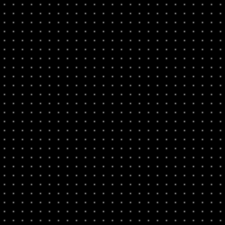
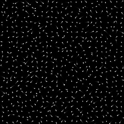

# Harlem Shake
In this exercise the goal is to use noise to add movement to each of the ellipses in a grid. The goal is to imitate the [Harlem Shake](https://www.youtube.com/watch?v=8f7wj_RcqYk) logic. The final result should look like something in the _harlemShake.ogv_ video.

## Step by step
You can start with code from last week's _magneticGrid_ example as we are going to be building the same structure.

1. Inside the _ofApp.h_ file add the following two lines at the top:
```
#define numX 25
#define numY 25
```
This way we declare and give initial values to the resolution of the grid. We need to do that as we are going to be using arrays (similar to vectors) to store points on the noise function. Also define `spacingX`, `spacingY` which will store the spacing between our shapes and `startingX`, `startingY` which will store the starting position of the first shapes. We don't want the first shape to be at `(0,0)`, that's the origin. Where do we want it?
Define also a variable of type `bool` called `goCrazy` which will store the state of the Harlem Shake (many vs. one person dancing). Also define a variable `stepSize` of type `float` which will store the amount of movement that we will want to allow the particles to move. Finally add this line of code:
```
float noiseSeeds[numX][numY];
```
which will create a static array to store our noise seeds or points on the noise function where each circle is going to read from. We want them to read from different points because we want them to have different movement from each other.
2. In the `setup()` function set the background to black, calculate the `spacingX` & `spacingY` as well as the `startingX` and `startingY` as we did last week. Set the `stepSize` to 20. Write a nested for loop (using the `numX` and `numY` variables in the conditional) to loop over the values inside the `noiseSeeds` 2D array and set each entry to a random value between 0 and 1000. Addressing a 2D array is the same as a 2D vector (ie the first position is `noiseSeeds[0][0]`). Set `goCrazy` to `false`.
3. At the top of the `draw()` loop add a rectangle that covers the whole canvas of black color but of alpha=20 so that the shapes leave a trail. Right after drawing the rectangle set the color to white again, without transparency. Continue inside the `draw()` function by writing a nested for loop (using the `numX` and `numY` variables in the conditional). Within the loop create the local variables `locX` and `locY` of type `int` that will store in each iteration the location of each shape. Calculate and display the location of the circles as in the image below.
<br>
<br>

<br>
<br>
4. Multiply by `stepSize` the value the outcome of `ofSignedNoise()` after you have passed to it the corresponding value of the 2D array `noiseSeeds[][]`. Add the resulting value to `locX`. Do the same for `locY`. __Attention:__ remember to add a number (say 500) to the value you pass to `ofSignedNoise()` because we don't want the `locX` and `locY` to have the same noise added to them.
5. Draw ellipses at `locX`, `locY` with of width and height 3. Remember to add 0.02 to the specific `noiseSeeds` location. Make sure you also At this point when you start your program you should see all of the ellipses move like the image below.
<br>
<br>

<br>
<br>
6. Time to add a conditional. Inside the for loop, execute the code that calculates the noise and adds it to the `locX` `locY` only when the `goCrazy` variable is true. Otherwise execute the code only when we are at the 20th ellipse on the x axis and the 20th on the y-axis. Go to the `mouseClicked()` function and have the `goCrazy` flick back and forth between true/false every time the mouse is clicked. It can be done in one line of code.

__BONUS:__
* Every time the mouse is clicked all of the shapes start suddenly moving but it's quite sudden. What would be a way for them to slowly start moving before reaching the level that they are at the present moment? In other words if they were people they would go from resting position to movement rather than be found IN movement from one frame to the next. How would that be done?
