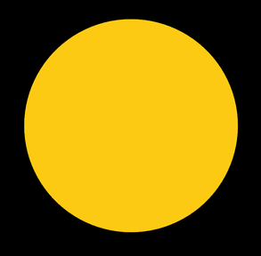

# Noisy sun
In this example you are going to use the the sine and cosine function to generate points on a circle where the radius is varied by noise. These points are then going to be connected into a shape creating the structure shown in the _sun.mkv_ video.

## Step by step
1. In the _ofApp.h_ create a vector called `noiseSeeds` of type float. Also create 3 floats called `angleStep`, `stepSize`, `radius`. Also define `sunLoc` a variable of type `ofPoint` which is a structure to store point data and works exactly the same as `ofVec3f` [see doc](http://www.openframeworks.cc/documentation/math/ofVec3f.html). Also define a variable `totalRays` of type int. This will be the resolution of the sun.
2. In the `setup()`, set the background to black, set `totalRays` to 100, `stepSize` to 200, `radius` to 300 and `angleStep` make it equal to 360.0 divided by `totalRays`. Notive the decimal after the 360. That is intentional as we want the division to be between floats. Set the `sunLoc` to the center of the screen and the circle resolution to 60. Create a for loop that adds random values between 0-10000 in the `noiseSeeds` array using the `push_back` function. The loop should stop when `totalRays` number of values have been filled.
3. In the `draw()` function, translate to `sunLoc` set the color to (253, 202, 19). We'll be using `ofBeginShape()` [see doc](http://openframeworks.cc/documentation/graphics/ofGraphics.html#show_ofBeginShape) to draw a custom shape on screen. Look at the example _randomPerimeter_ how we generate points on a circle. Copy the code from there and encapsulate the for loop with a `ofBeginShape()`/`ofEndShape` command. The point you calculate add it to the shape using the `ofVertex()` commnand. In the _randomPerimeter_ example the radius is constant. When you run your code you should see something like the image below:
<br>
<br>

<br>
<br>
4. We now want to add a certain amount to that using the noise function. Create a new variable inside the for loop of type `float` called `noisedRadius`. Make it equal to whatever the `ofNoise()` function returns when you pass it the `noiseSeeds` variable at the corresponding array position. Make sure you also multiply the returning value of `ofNoise()` by the `stepSize` in order to define how much you want the movement to be. Add to the result the `radius`. The `noisedRadius` variable contains the new radius of the point. Ammend the code that calculates each point on the circle to use the `noisedRadius` value. Increase the corresponding `noiseSeeds` value by 0.01, before exiting the loop.
5. Final touch: After the `ofEndShape()` has been called, set the color to (255,215, 13) and create a circle at location 0,0 with radius 300.

__Further development (for home):__
* Turn the background into white in the setup and stop updating it. Turn fill off and keep just the shape that is created with begin shape. Set the color of the shape to black with an alpha of 30. Right before translating to `sunLoc` add these lines of code.
```
if (mouseX != 0 || mouseY != 0)
{
   sunLoc.x += (mouseX-sunLoc.x) * 0.01;
   sunLoc.y += (mouseY-sunLoc.y) * 0.01;
}
```
which will make the shape float towards the mouse. For a smoother shape, how about reducing the number in `totalRays`? See the _shapesFromAgents_ video file for a possible outcome.

__Bonus (optional):__ For ultimate smoothness between points you could use the `ofCurveVertex()` command. See the [processing documentation](https://processing.org/reference/curveVertex_.html) for the command as it's better. Logic is the same.
