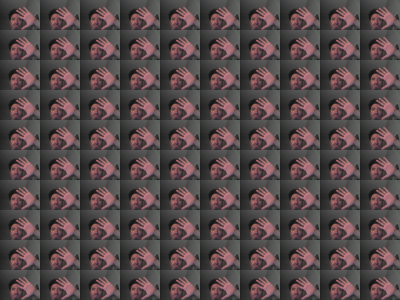
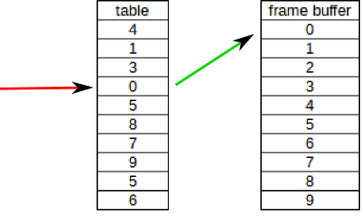

# Frame Buffer Grid
In this exercise the goal is to use the deque container (see [documentation](http://www.cplusplus.com/reference/deque/deque/)) as a buffer to create a grid of frames. The final result should look like something in the _orderedGrid.ogv_ video.

## Step by step
Start with code from _frameBufferDelay_ as we are going to be building the same structure. Make the following changes:

1. Inside the _ofApp.h_ file create the `numOfTiles` variable of type `int` (where we are going to store the number of tiles/frames on each direction.
2. In _main.cpp_ set the size of the window to 960x720. You can later modify the size, as long as you keep the ratio so that the image that comes from the camera is not deformed.
3. In `setup()` function initialize the `numOfTiles` to 10. Set the `imgWidth` to the window width divided by the `numOfTiles`. Do the equivalent for the `imgHeight`. Modify the `videoGrabber.initGrabber(...)` line to include these sizes. This will define the size that we want the frame to be when it comes out of the camera. Size we're going to be using small size images there's no reason to ask for higher res. Modify the `maxBufferSize` line to be like this:
```
maxBufferSize = numOfTiles * numOfTiles;
```
Since the `numOfTiles` is 10 it means that we'll fit 10x10 images on our screen, therefore `maxBufferSize` would be 100.
4. We don't need to modify the _update()_ function, but make sure you understand what's going on there! Ask me if you don't!
5. And now for the meaty part! In the _draw()_ create a variable of type `int` called `imgIndex` which is initialized to 0. Create a nested for loop (a loop within a loop) at the heart of which will be the `draw()` command (see [documentation](http://openframeworks.cc/documentation/graphics/ofImage.html#!show_draw)) on the first element (first image) of the deque we created. Use the `imgWidth`/`imgHeight` in your for loops as well as the `ofGetWidth`/`ofGetHeight` to achieve the grid shown below.
<br>
<br>

<br>
<br>
Notice that all the images are the same because we're always drawing the first frame. Right under the image draw command add this line:
```
imgIndex++;
```
This will update the index of the image that we want to draw. As we're looping on the x and y axis within the loop, this value is updated so that we can draw the next frame in the queue. Use this value as an index in the image draw operation. If you run the program now it will crash. This is because it asks from the very beginning all of the frames. We know that we have to wait a few seconds before the 4-5 seconds of video have filled the memory and can be displayed on a grid. Therefore, you'll need to surround the two lines of code you have inside the nested for-loop with an if statement. That if statement should do some sort of comparison between the size of the `imgBuffer` (which is of type `deque` - see [documentation](http://www.cplusplus.com/reference/deque/deque/)) and the `imgIndex`. I'll let you figure out the details. Once you add this if-statement your program is ready to go!

----
# Random Buffer Grid
Modify the program above to mix-up the order of how the frames are displayed as shown in the _randomGrid.ogv_ video.

## Step-by-step
Start a new project and copy the code you worked on for the _frameBufferGrid_. The code is 95% there already. All we'll need to do is add the random element. You can't just use `ofRandom()` inside the `imgBuffer[imgIndex].draw(x,y);` because this will just select random images from the queue at every iteration of the draw() loop of ofx. What we need is a look-up table where we will store the random values and use this tabe __every__ time we want to draw the grid. Therefore:
1. Create a vector of type `int` inside the _ofApp.h_ and call it `table`.
2. Inside the `setup()` function create a for loop to fill the `table` (using `push_back()`) with random values. We'll want as many random values as there are places in the buffer (ie. maxBufferSize). The values inside the `ofRandom()` call should range from 0 to `maxBufferSize`. We'll use that table to store the "new correspondence" between frame location and frame order.
<br>
<br>

<br>
<br>
The red arrow is where the `imgIndex` is pointing, while the green arrow is the lookup operation that returns the new frame index that should be in that position.
3. Modify the following line in your draw() loop:
```
imgBuffer[imgIndex].draw(x,y);
```
To read the random position in the lookup table we created. Can you figure it out? You'll also need to modify the if statement to make sure the buffer is full before starting to display images. This is because we can't have our program calling random frames in the buffer before we make sure that they actually exist.

----
# Assignment for home
* How about using red, green, or blue to give each frame a different tint before displaying it? It should be one of these 3 or 3 of your choice. One way of doing it is randomly generate a number between 0-2 and depending of what that number is assign a color right before displaying the frame.
* How about using `drawSubsection` (seen on the next exercise) to draw random parts of each image on each frame. Perhaps one frame could show from pixel (0,0) to (20,20) (don't worry about stretching). Make sure each location always draw the same random assigned part of the image. You'll have to create some new vectors for all the random data that you'll be using.
* Can you think of any other extensions?
