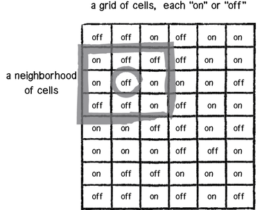

# Game of Life
In this assignment you'll take the code already provided in this directory, study it and make the modifications below. Notice that I've used two classes. The Cell class which describes a cell and its state (on/off) among other things and the GOL (Game of Life) class which contains a 2D vector (like a 2D array) of cells and runs the game.
 
 

 
 
From one generation to the next the pixels change form depending on how many neighbours they have. In the version provided the rules are:
* If you are alive & have less than 2 neighboughs you die of loneliness (you become white).
* If you are alive & have more than 3 neighboughs you die from overpopulation (you become white).
* If you are NOT alive & have exactly 3 neighboughs you get born (you become black).
* Otherwise you stay as you are.
An example of the rules on the grid is illustrated below:
 
 

 
 
The calculation of what should happen in the next generation is done inside the `generate()` function of the `GOL` class (have a look at the code).

## Step by step instructions:
1. __Run the program:__ and make sure it compiles. Let it run for a bit until it reaches a point where there is no progress. Do you notice any of the patterns mentioned in [this](https://en.wikipedia.org/wiki/Conway's_Game_of_Life#Examples_of_patterns) section of the wikipedia article? Can you tell why they are reaching that equilibrium?
2. __Add interaction:__ Change the code so that every time you click the mouse a new board is generated.
3. __Add more colors:__ Modify the Cell class so that the part that draws the actual rect does more than black (if cell is alive) and white (if cell is dead). Since we are storing the previous state of the cell in order to do the calculations of the current state, use that and turn:
 * cells who were previously dead, but are now getting alive to blue
 * cells who were previously alive, but are now getting dying to red
 * cells who alive and are still alive stay black
 * all others white
4. __Add some history:__ So far we used two variables to keep track of the state of each cell: current and previous. Let's keep a list of the past 10 states. You can use a [deque](http://www.cplusplus.com/reference/deque/deque/) like the one we used in week 6 for the image frames so that you add values at the end of the queue and take out from the front. Use the posistion of the last "live" state of the cell along with color lerping ([see documentation](http://www.openframeworks.cc/documentation/types/ofColor.html#show_getLerped)) to assign a color depending on how far back the cell was alive. If a cell was alive 5 frames ago (out of 10) then we should get between the two color states, etc. Play by adding more history. It should start looking like a fungus. Add more history positions.
5. __Turn it probabilistic:__ Look into the Cell class and rewrite the Game of Life rules as follows:
  * Overpopulation: If the cell has four or more alive neighbors, it has a 80% chance of dying.
  * Loneliness: If the cell has one or fewer alive neighbors, it has a 60% chance of dying.
  * Reproduction: If the cell has two or three alive neighbors, it has a 70% chance of getting born.
  * Play around a bit with the probabilities and see how they affect the final result.
