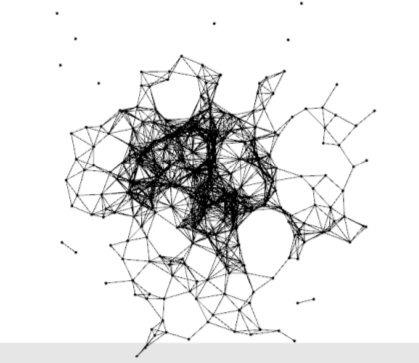

# Good features to track
In this assignment you'll have to study the code provided and do something interesting with the data extracted by the algorithm. The idea is to built something similar to what Memo did for [this](http://www.memo.tv/archive/tags/openframeworks) video.

### General instructions
* Generate a new project (don't forget to include the ofxOpenCV addon) and copy the code from the _goodFeaturesToTrack_ folder.
* When you run the code you'll see the following points:
  * __Blue points:__ represent the blob points. These are the points only of the first blob and are provided here to help you get started. If you want more blobs you'll have to loop over the blobs object yourself. Once I got the points from the blob I also resampled them to reduce the number of points used.
  * __Red points:__ These are good points to track as used by the inner function of openCV (not ofxCV). That is why the code looks a bit different there. See the [documentation](http://docs.opencv.org/2.4/modules/imgproc/doc/feature_detection.html#goodfeaturestotrack) page of the algorithm for what the parameters mean.
* The mouseX affects the threshold level.
* Play with the parameters like the amount of blur, the parameters of the above algorithm itself to see what generates a better set of interesting points.
* Why not use the code provided in pg. 180 in the openFrameworks book to generate something like the image below using camera data.
 
 

 
 
Alternatively you could use the [ofxDelaunay](http://github.com/obviousjim/ofxDelaunay) or [ofxVoronoi](http://github.com/madc/ofxVoronoi) to display the data in an interesting way. There's also the [Triangle](https://www.cs.cmu.edu/~quake/triangle.html) library which is quite powerful, but doesn't exist as an addon and you'd have to import it yourself (Example provided).
* You'll need to use dillation and erosion (both included with openCV (see chapter 9 from openFrameworks book) and finetune the rest of the parameters to get something good looking.
* I strongly advise you to read the [blog post]((http://www.memo.tv/archive/tags/openframeworks) by Memo for hints about tricks he used.
