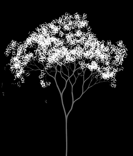

# Realistic Recursive Tree
Improve the _recursiveTree_ example shown in class to make it look more realistic as shown in the video sample _realisticRecursiveTree.mkv_ and the image below.
 
 

 
 
### General steps:
* Currently only the length `len` of the branch changes as the `branch()` function gets called again. Use the `len` to also set the line width so that the lines get thinner as you move to the top branches. You'll need to use `ofSetLineWidth()` for that.
* Currently at each call for `branch()` we are creating two branches, one on the left and one on the right. Turn the number of branches into a variable and have it be random. In order for it not to change in each frame call the `ofRandomSeed()` ([see documentation](http://openframeworks.cc/documentation/math/ofMath/#show_ofSeedRandom)) function in the `setup()`. This will make sure that the sequence of calls to the `ofRandom()` returns always the same numbers. It will create a new tree only if you call the `ofRandomSeed()` again, or if you restart the program.
* Have the angle `theta` change with noise. You can use the `ofNoise()` with 2 parameters. One will have the level where you are in the branch and the other the other will be moving along the time axis in the noise function. This will create a tree moving realistically in the wind.
* How about adding letters as leaves in the top branches?

### Ideas for further development
* Instead of using lines to draw the branches you could use bezier curves and the `ofBeginShape()`/`ofEndShape()` commands to connect one branch with the other in order to add more realism? Start with a very basic curve in Processing to make sure you understand bezier curves, before moving the 2-3 lines of code per branch needed back to openFrameworks.
* Vary the length of the branches in order to make the tree grow from the ground.
