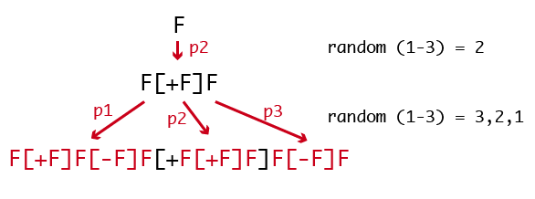

# Prairie of L-System trees

### Generating some examples:
Start by playing with the following examples:

__Example 1__
```
iterations: 5
angle: 20
axiom: F
rule1: F → F[+F]F[-F][F]
```
__Example 2__
```
iterations: 7
angle: 20
axiom: X
rule1: X → F[+X]F[-X]+X
rule2: F → FF
```
__Example 3__
```
iterations: 5
angle: 22.5
axiom: X
rule1: X → F-[[X]+X]+F[+FX]-X
rule2: F → FF
```
If you'd like to further experiment search for more rules on the web.

### Add a bit of randomness
Currently the grammar is completely deterministic. Add randomness by having different ways of interpreting a letter. For example:
```
w: F
p1: F (0.33)→ F[+F]F[-F]F
p2: F (0.33)→ F[+F]F
p3: F (0.33)→ F[-F]F
```
Will generate one of three possible scenarios as shown in the image below:
<br>
<br>

<br>
<br>
Which means that if `ofRandom(1)` returns a number `<0.33` then `p1` applies, if it's `>=0.33` but `<0.66` then `p2` applies and if it's `>=.66` then `p3` applies.

### Combine L-systems with genetic algorithms:
It is typically very difficult to start with a given plant or intended form and invent a set of production rules that will produce it. By encapsulating the L-system within an evolutionary system one can "navigate" the design space and guide the system towards the intended result without having to understand or inspect the actual production rules. For more details on how to implement it see the assignment _superFormulaGeneticSculptor_.
